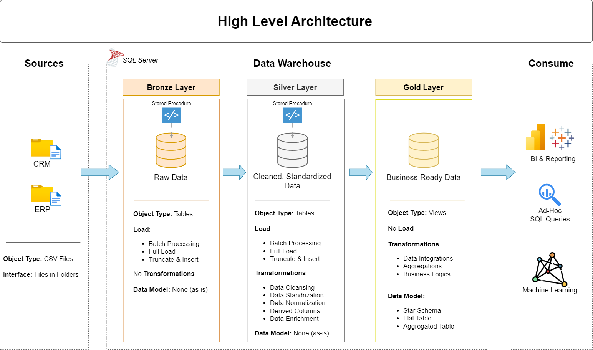
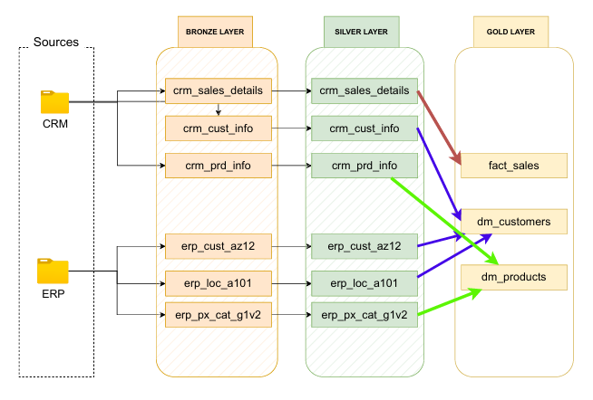
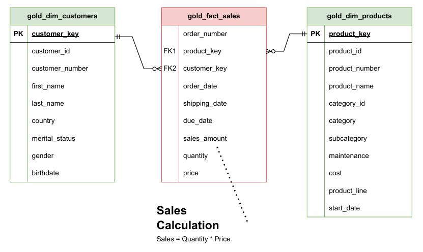
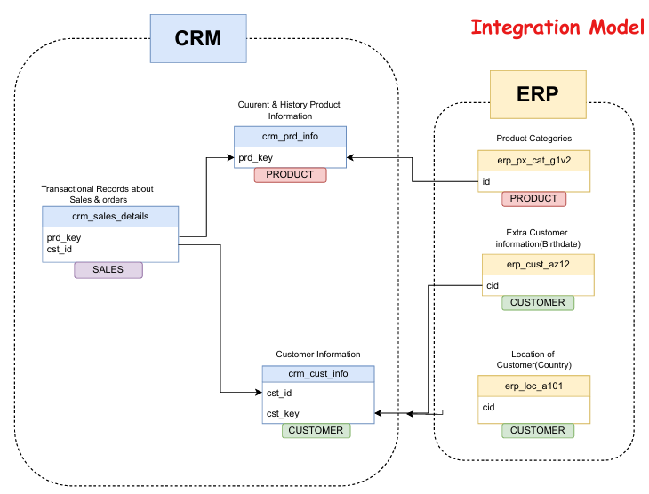

## 📖 Project Overview

Welcome to the **Data Warehouse Project** repository! 🚀  
This project showcases the end-to-end development of a modern data warehouse using **SQL Server**, following the **Medallion Architecture** (**Bronze**, **Silver**, **Gold**).  
It simulates a real-world data engineering scenario, where data from multiple systems is consolidated, cleansed, and modeled to support analytical reporting.

---

### 🔍 What This Project Covers:

#### 🏗️ Modern Data Architecture  
Designed around the Medallion Architecture, the project separates raw, cleaned, and business-ready data into distinct layers to ensure **data integrity**, **traceability**, and **performance**.

#### 🔄 ETL Pipelines  
Data is ingested from **CSV files** (ERP and CRM systems) into the **Bronze layer**, transformed in the **Silver layer** for consistency and quality, and finally modeled into a **Star Schema** in the **Gold layer** for analysis.

#### 🧱 Data Modeling  
A clean and efficient **Star Schema** design powers the analytics layer. The model includes **Fact** and **Dimension** tables tailored for performance in **reporting** and **BI tools**.

#### 🔗 Data Integration  
This project demonstrates how to merge data from different sources (ERP & CRM) into a single integrated model, solving challenges like **data quality**, **normalization**, and **schema alignment**.

#### ✅ Best Practices  
The project follows industry best practices including:
- Standardized naming conventions  
- Layered architectural approach  
- Modular and reusable SQL scripts  
- Visual documentation: data flow diagrams, data model diagrams, and integration design


---
## 🏗️ Data Architecture

The data architecture for this project follows Medallion Architecture **Bronze**, **Silver**, and **Gold** layers:


1. **Bronze Layer**: Stores raw data as-is from the source systems. Data is ingested from CSV Files into SQL Server Database.
2. **Silver Layer**: This layer includes data cleansing, standardization, and normalization processes to prepare data for analysis.
3. **Gold Layer**: Houses business-ready data modeled into a star schema required for reporting and analytics.

## Others Diagram 
## ***Data Flow Diagram***

## ***Data Model of Star Schema***

## ***Data_integration_model***

---
## 📖 Project Overview

This project involves:

1. **Data Architecture**: Designing a Modern Data Warehouse Using Medallion Architecture **Bronze**, **Silver**, and **Gold** layers.
2. **ETL Pipelines**: Extracting, transforming, and loading data from source systems into the warehouse.
3. **Data Modeling**: Developing fact and dimension tables optimized for analytical queries.
---

## 🛠️ Important Links & Tools:

Everything is for Free!
- **[Datasets](datasets/):** Access to the project dataset (csv files).
- **[SQL Server Express](https://www.microsoft.com/en-us/sql-server/sql-server-downloads):** Lightweight server for hosting your SQL database.
- **[SQL Server Management Studio (SSMS)](https://learn.microsoft.com/en-us/sql/ssms/download-sql-server-management-studio-ssms?view=sql-server-ver16):** GUI for managing and interacting with databases.
- **[Git Repository](https://github.com/):** Set up a GitHub account and repository to manage, version, and collaborate on your code efficiently.
- **[DrawIO](https://www.drawio.com/):** Design data architecture, models, flows, and diagrams.
- **[Notion](https://www.notion.com/templates/sql-data-warehouse-project):** Get the Project Template from Notion
- **[Notion Project Steps](https://www.notion.so/Data-Warehouse-Project-21b254ec764980268201fe75bd10ec77?source=copy_link):** Access to All Project Phases and Tasks.

---

## 🚀 Project Requirements

### Building the Data Warehouse (Data Engineering)

#### Objective
Develop a modern data warehouse using SQL Server to consolidate sales data, enabling analytical reporting and informed decision-making.

#### Specifications
- **Data Sources**: Import data from two source systems (ERP and CRM) provided as CSV files.
- **Data Quality**: Cleanse and resolve data quality issues prior to analysis.
- **Integration**: Combine both sources into a single, user-friendly data model designed for analytical queries.
- **Scope**: Focus on the latest dataset only; historization of data is not required.
- **Documentation**: Provide clear documentation of the data model to support both business stakeholders and analytics teams.

---
## 📂 Repository Structure
```
data-warehouse-project/
│
├── datasets/                           # Raw datasets used for the project (ERP and CRM data)
│
├── docs/                               # Project documentation and architecture details
│   ├── Data_integration_model.drawio   # Draw.io file shows how to model integrate
│   ├── data_architecture.drawio        # Draw.io file shows the project's architecture
│   ├── data_catalog.md                 # Catalog of datasets, including field descriptions and metadata
│   ├── data_flow_diagram.drawio        # Draw.io file for the data flow diagram
│   ├── Data_model_of_star_schema.PNG   # Draw.io file for data models (star schema)
│   ├── naming-conventions.md           # Consistent naming guidelines for tables, columns, and files
│
├── scripts/                            # SQL scripts for ETL and transformations
│   ├── bronze/                         # Scripts for extracting and loading raw data
│   ├── silver/                         # Scripts for cleaning and transforming data
│   ├── gold/                           # Scripts for creating analytical models
│
├── tests/                              # Test scripts and quality files
│
├── README.md                           # Project overview and instructions

```
---

## 🌟 About Me

Hi there! I'm **MD HABIBUL BASHER SAIKAT**. I’m an undergrade student on a mission to gain knowledge and make working with data enjoyable and engaging!

